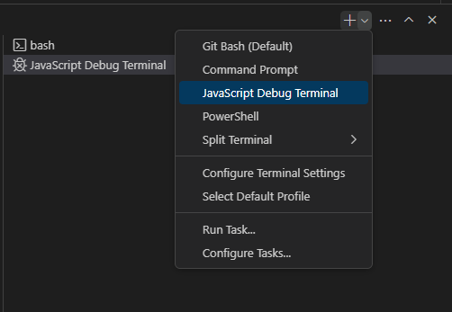
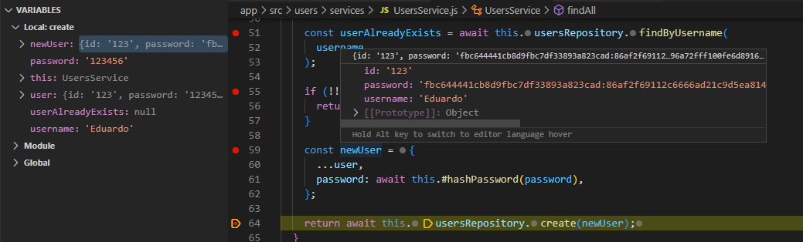

# User Authentication with Node.js

## Technologies

- Node@20.9.0

## How to run

- `npm run dev`: runs the server,
- `npm run test`: runs the server AND tests,
- `npm run test:dev`: runs the server AND tests in watch mode.

## Few things I learned

### password hashing and salting

(TODO)

### Converting Callbacks to Promises

Originally, the scrypt asyncronous function looks like this:

```javascript
return new Promise((resolve, reject) => {
  // ...
  crypto.scrypt(password, salt, 64, (err, derivedKey) => {
    if (err) reject(err);

    resolve(salt + ":" + derivedKey.toString("hex"));
  }); // <-- callback
}); // <-- callback
```

It will return the derivedKey (TODO). It is possible to convert the callback `(err, derivedKey) => {}` from scrypt to a promise with promisify module.

```javascript
const scryptAsync = promisify(crypto.scrypt);
// ...
const derivedKey = await scryptAsync(password, salt, 64);

return salt + ":" + derivedKey.toString("hex");
// No callbacks at all
```

### Debugging with Tests on VSCode

To debug this app, I was using console.log() all the times. It works, but it is VERY inefficient, even with the help of automated tests (they saved a lot though).

To debug for real, we have to use the VSCode debugger. It's very easily to do this by opening a new terminal called **JavaScript Debug Terminal**.



- Open JavaScript Debug Terminal.
- Set breakpoints in the code where you want to know what it's happening.
- Run `cd app/` and `npm run tests` on the JavaScript Debug Terminal (_you can manually debugging by running the server and sending request via curl, but it is very demanding_).
- Debug it. Simple as that. Hover on the variables to see their current values and proceed.



### http response status code

- 400 Bad Request: The server cannot or will not process the request due to something that is perceived to be a client error (e.g., malformed request syntax, invalid request message framing, or deceptive request routing).
- 401 Unauthorized: The client doesn't have access a information, it must authenticate itself to get the requested response.

### ts-check all files (even if it's javascript)

Create `jsconfig.json` file to enable ts type checking. Since vanilla javascript lacks supports to type checking, this is super useful since it enable to rapidly see errors and handle them.

## Errors I found

### TypeError: Body is unusable

Happens when trying to await the same request twice.

```javascript
console.log(await request.text()); // X only this is logged
console.log(await request.json()); // --> throws error
```

To fix it, only await the request once:

```javascript
console.log(await request.json());
```

Or you can [`clone()`](https://developer.mozilla.org/en-US/docs/Web/API/Request/clone) the request:

```javascript
const request = new Request("flowers.jpg");
const newRequest = request.clone(); // a copy of the request is now stored in newRequest
```

## Fonts

- [Build Node.js User Authentication - Password Login](https://www.youtube.com/watch?v=Ud5xKCYQTjM)
- [JWT Authentication Tutorial - Node.js](https://www.youtube.com/watch?v=mbsmsi7l3r4)
- [Hash your passwords with scrypt using Nodejs crypto module](https://dev.to/farnabaz/hash-your-passwords-with-scrypt-using-nodejs-crypto-module-316k)
- [JS Projects Utilizing TypeScript](https://www.typescriptlang.org/docs/handbook/intro-to-js-ts.html)
- [What is a tsconfig.json](https://www.typescriptlang.org/docs/handbook/tsconfig-json.html)
- [How to enable ts-check in es6](https://stackoverflow.com/questions/53157373/how-to-enable-ts-check-in-es6)
- [Private properties](https://developer.mozilla.org/en-US/docs/Web/JavaScript/Reference/Classes/Private_properties)
